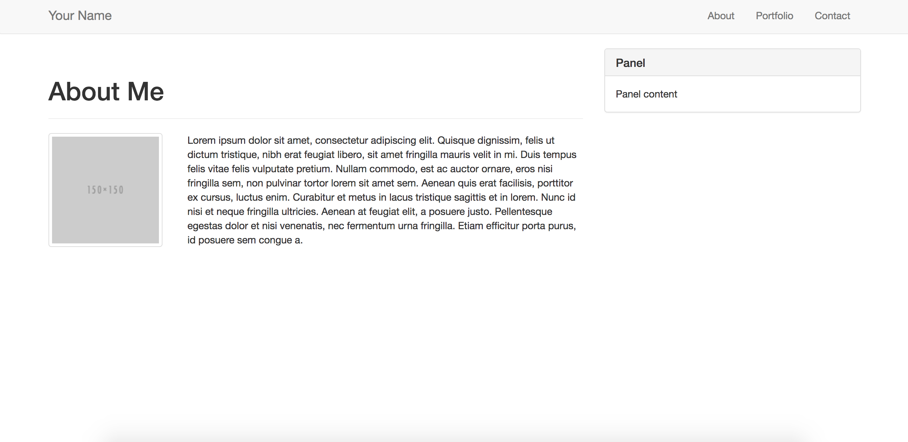

### File

* *None*

### Instructions

* Working in pairs and using Twitter Bootstrap make a page that looks like the following image:

  

* Be sure to note the:
  * Grid Layout
  * Navbar
  * Sidebar panel
  * Thumbnail
